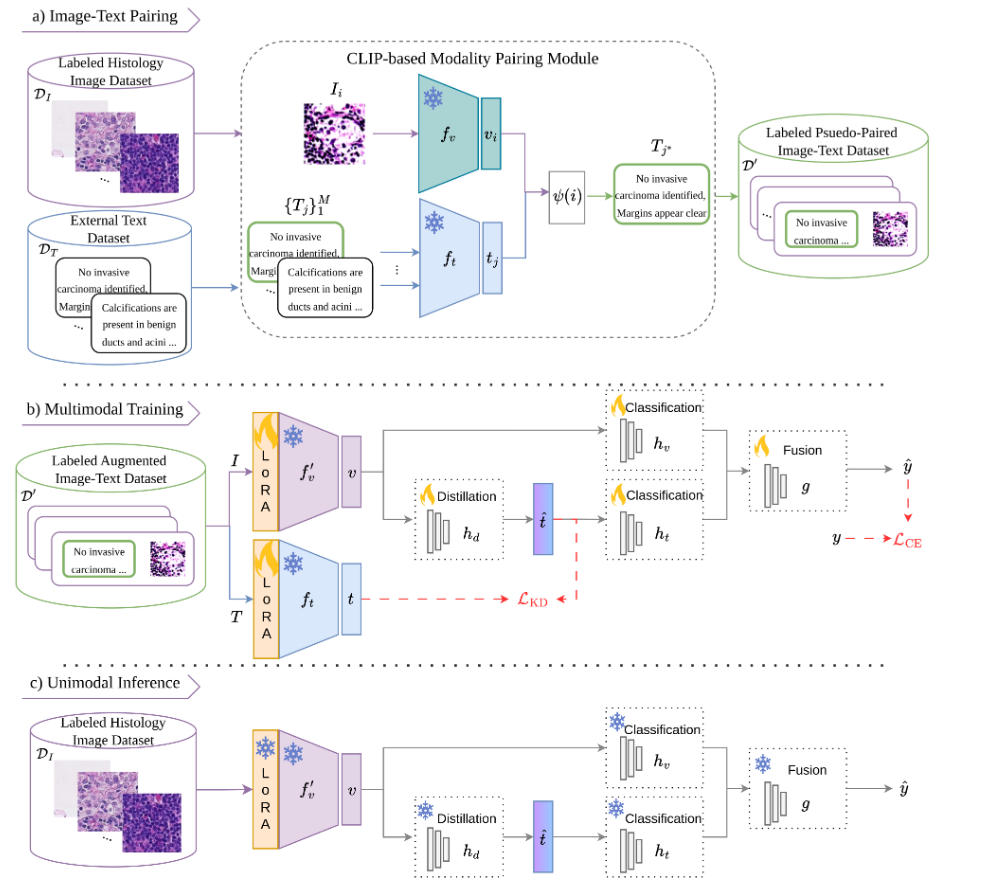

# CLIP-IT: CLIP-based Pairing of Histology Images with Privileged Textual Information

> **CLIP-IT** is a novel framework for enhancing histology image classification by **pairing vision data with external, unpaired text reports** using CLIP-based matching. It **trains a unimodal classifier with multimodal benefits** — without requiring text at inference time.

---

## 🔍 Overview

Current multimodal vision-language models (VLMs) for cancer diagnosis rely on expensive, manually paired datasets of histology images and pathology reports. CLIP-IT tackles this bottleneck by:

- **Pairing** histology images with relevant external reports using a CLIP model.
- **Distilling** knowledge from the text modality into the vision model using feature-level distillation.
- **Discarding** the text modality at inference time — fast and efficient deployment.

<p align="center">
  
</p>

---

## 🧠 Core Contributions

- ✅ Use of a **CLIP-based retrieval system** to match histology images with semantically related external reports  
- ✅ Training via **multimodal fusion and distillation** to enhance vision-only classifiers  
- ✅ Final model is **unimodal at test time** — no access to text required  
- ✅ Compatible with **any vision backbone and any unpaired textual corpus**

---

## 📦 Installation

```bash
git clone https://github.com/BanafshehKarimian/ModalityPairing.git
cd ModalityPairing
pip install -r requirements.txt
```

Ensure you have the required datasets (PCAM, BACH, CRC) and optionally TCGA reports for pairing.

---

## 🧪 Datasets Used

| Dataset | Description                | Classes | Patch Size   | Magnification |
|---------|----------------------------|---------|--------------|----------------|
| PCAM    | Breast tissue              | 2       | 96×96        | 10x            |
| BACH    | Breast cancer histology    | 4       | 2048×1536    | 20x            |
| CRC     | Colorectal cancer          | 9       | 224×224      | 20x            |

External text modality: TCGA pathology reports.

---

## 🚀 Training
First download the conch checkpoints and put it in the following location:

```bash
CONCH/checkpoints/conch/pytorch_model.bin
```

Then get the text:
```bash
python get_text.py --keyword tissue_type
```
The paired indexes are in the Paired_indexes folder, but for any dataset, you can use a method as shown in map_text_pcam.py. 

Then you need to fine-tune the text model:
```bash
python finetune_text.py --ds pcam 
```

And finally train your CLIPIT:

```bash
python train_fuser_.py --ds pcam --model UNI --lora_r 16 --lora_alpha 4
```

## ⚙️ Script Arguments

The main training script supports a wide range of arguments for flexible configuration:

### 📁 Dataset and Experiment Settings

- `--model`: Vision backbone (UNI, DINOL14, VITS_8, VITS_16, VITB_8, VITB_16)
- `---ds`: Dataset (pcam, bach, crc)
- `--run`: Run identifier for experiment versioning
- `--dir`: Directory to save logs and checkpoints
- `--output`: Output folder for this run

### 🔧 Training Hyperparameters
- `--batch`: Batch size (default: 64)
- `--lr`: Learning rate (default: 0.001)
- `--ep`: Number of training epochs
- `--worker`: Number of data loader workers
- `--val-int`: Fraction of training data for validation (e.g., 0.1 for 10%)
- `--clip`: Gradient clipping value (default: 0.5)
- `--weight-decay`: Weight decay for optimizer
- `--scheduler`: Whether to use learning rate scheduler (0 or 1)

### 🧠 LoRA Configuration
- `--lora-r`: LoRA rank (e.g., 16)
- `--lora-alpha`: LoRA scaling factor
- `--lora-dropout`: Dropout used in LoRA modules
- `--lora-text`: Apply LoRA to text encoder (1 = yes, 0 = no)
- `--lora-vision`: Apply LoRA to vision encoder (1 = yes, 0 = no)
- `--no-lin`: Remove linear layer from LoRA targets
- 
### 🛠 Optimization and Logging
- `--monitor`: Metric to monitor (e.g., `val_loss`)
- `--mod`: Mode for monitoring (`min` or `max`)
- `--patience`: Early stopping patience
- `--early`: Enable early stopping
- `--log`: Logging frequency in epochs
- `--wandb`: Enable Weights & Biases logging
- `--chkpnt`: Save model checkpoints
---

## 📈 Results

| **Vision**                | **PCAM Unimodal** | **CLIP-IT** | **Δ (%)** | **BACH Unimodal** | **CLIP-IT** | **Δ (%)** | **CRC Unimodal** | **CLIP-IT** | **Δ (%)** |
|--------------------------|-------------------|-------------|-----------|-------------------|-------------|-----------|------------------|-------------|-----------|
| UNI [Chen2024]           | 0.942 ± 0.0008     | **0.955 ± 0.0015** | **+1.3%** | 0.789 ± 0.0090     | **0.818 ± 0.0114** | **+2.9%** | 0.947 ± 0.0021    | **0.959 ± 0.0003** | **+1.2%** |
| DINO [Gatopoulos2024]    | 0.889 ± 0.0043     | **0.923 ± 0.0048** | **+3.4%** | 0.843 ± 0.0133     | **0.861 ± 0.0185** | **+1.8%** | 0.944 ± 0.0020    | **0.959 ± 0.0003** | **+1.5%** |
| VITB-16 [Gatopoulos2024] | 0.881 ± 0.0063     | **0.914 ± 0.0074** | **+3.3%** | 0.808 ± 0.0124     | **0.829 ± 0.0261** | **+2.1%** | **0.959 ± 0.0012** | 0.957 ± 0.0009     | -0.2%    |
| VITS-16 [Gatopoulos2024] | 0.884 ± 0.0015     | **0.909 ± 0.0064** | **+2.5%** | 0.829 ± 0.0321     | **0.846 ± 0.0385** | **+1.7%** | 0.938 ± 0.0015    | **0.953 ± 0.0010** | **+1.5%** |
| VITB-8 [Gatopoulos2024]  | 0.875 ± 0.0041     | **0.919 ± 0.0050** | **+4.4%** | 0.869 ± 0.0134     | **0.871 ± 0.0081** | **+0.2%** | **0.957 ± 0.0005** | **0.957 ± 0.0026** | +0.0%    |
| VITS-8 [Gatopoulos2024]  | 0.879 ± 0.0035     | **0.902 ± 0.0052** | **+2.3%** | 0.810 ± 0.0176     | **0.826 ± 0.0091** | **+1.6%** | **0.950 ± 0.0006** | 0.948 ± 0.0030     | -0.2%    |

CLIP-IT yields consistent performance gains with minimal inference overhead.

---

## 🔬 Citation

If you use this work, please cite:

```bibtex
@inproceedings{karimian2025clipit,
  title={CLIP-IT: CLIP-based Pairing of Histology Images with Privileged Textual Information},
  author={Karimian, Banafsheh and Avanzato, Giulia and Belharbi, Soufian and McCaffrey, Luke and Shateri, Mohammadhadi and Granger, Eric},
  booktitle={arxiv},
  year={2025}
}
```

---
